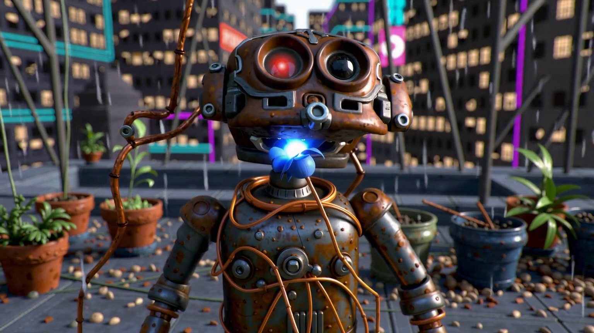
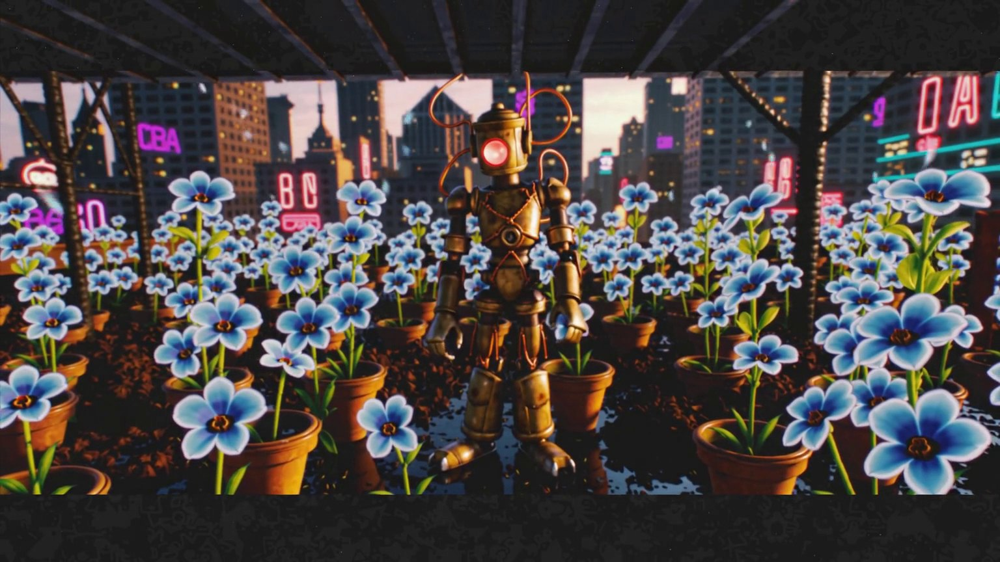
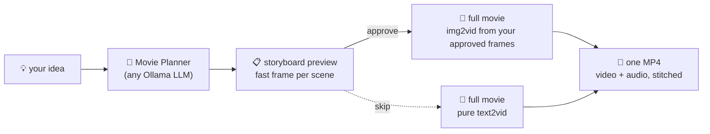

<div align="center">

# 🎬 Auto Movie Director

**Type a movie idea. Get a finished short film.**

Plot · storyboard approval · every scene rendered with video **and** sound · one stitched MP4 — all local.

[](LICENSE)
[](https://github.com/comfyanonymous/ComfyUI)
[](https://github.com/Lightricks/ComfyUI-LTXVideo)
[](https://ollama.com)


*fully automatic — one prompt wrote, storyboarded, filmed, scored, and edited this*

  

</div>

---

## What it does

You give it **one idea** and pick **any number of scenes (1–24), any seconds per scene, any resolution, any frame rate**. A local LLM (via Ollama — **any model you name, auto-downloaded** if missing) becomes your screenwriter: three-act structure, a reusable character sheet for cross-scene consistency, an explicit shot type and camera move for every scene, and a concrete **`Audio:` sound-design line per scene** that LTX turns into an actual soundtrack.

Then the Renderer expands into one full LTX 2.3 render chain **per scene** — video *and* audio — writes every scene to disk, and ffmpeg-stitches the finished film (H.264 CRF 16 + AAC) that previews right on the node.



## The studio flow

| Step | What you do | What happens |
|---|---|---|
| **① Write** | Type the idea. Set scene count & seconds. Optionally type any individual scene yourself — per-scene boxes appear on the node; empty ones are written by the AI. | LLM writes plot + character sheet + N cinematic scene prompts with sound design. |
| **② Preview** | mode = `1) storyboard preview` → Queue | One fast frame per scene + a titled storyboard with timecodes, saved to `output/auto_movie/`. Thumbnails appear next to each scene box. |
| **③ Approve** | Like it? Touch nothing. Don't? Edit and re-queue. | Same seed + prompts = the exact frames you approved are locked. |
| **④ Render** | mode = `2) full movie (img2vid from storyboard)` → Queue | Each scene **starts from its approved frame** (sharpened through the LTX spatial upscaler), gets motion + audio, stitched to one MP4. |

No storyboard wanted? `full movie (pure text2vid)` goes straight to film.

## Install

```bash
cd ComfyUI/custom_nodes
git clone https://github.com/AdamGman/ComfyUI-AutoMovieDirector
```

Restart ComfyUI, then open **`example_workflows/Auto Movie Director.json`** — everything is pre-wired; just point the loaders at your LTX models.

<details>
<summary><b>Requirements</b></summary>

| What | Why |
|---|---|
| [ComfyUI](https://github.com/comfyanonymous/ComfyUI) 0.27+ | node-expansion API |
| [ComfyUI-LTXVideo](https://github.com/Lightricks/ComfyUI-LTXVideo) | LTX video+audio nodes |
| [ComfyUI-GGUF](https://github.com/city96/ComfyUI-GGUF) | only for GGUF-quantized LTX transformers |
| [Ollama](https://ollama.com) | the screenwriter LLM (offline fallback built in) |
| `imageio-ffmpeg` | stitching (`pip install imageio-ffmpeg` if you don't have VideoHelperSuite) |

**LTX 2.3 models** in your model folders: transformer (fp8 **or** GGUF + distilled LoRA), Gemma text encoder + LTX text projection, video VAE + audio VAE, and the LTX spatial upscaler (recommended — it sharpens storyboard frames before they guide the render).

</details>

## Everything is a dial

- **Scenes**: 1–24, each with its own optional prompt box
- **Length**: seconds per scene (frame counts snap to what LTX wants automatically)
- **Resolution**: anything /32 up to 2048 — 1536×864 is the 24 GB sweet spot
- **Frame rate**: 8–60 fps (24 = cinema)
- **Sampler / scheduler / steps / cfg / seed**: full control
- **`preview_size`**: how fast/rough the storyboard pass is
- **`storyboard_strength`**: how hard scenes stick to approved frames (lower = freer motion)
- **`ollama_model`**: any model from the [Ollama library](https://ollama.com/library) — auto-pulled on first use (default `qwen3.6:latest`; `llama3.2:3b` works if you're tight on VRAM)
- **`output_dir`**: optional extra folder for the final film

## Outputs

```
output/
├── auto_movie_<timestamp>.mp4        ← 🍿 the film (video + audio)
└── auto_movie/
    ├── storyboard_<id>/              ← storyboard.png · scene_XX.png · scenes.txt
    └── <run_id>/                     ← per-scene MP4s · plot.txt
```

## Notes

- A 5-second 1536×864 scene ≈ 2 minutes on an RTX 4090; the storyboard pass is a few seconds per scene.
- Keep **seed and prompts unchanged** between preview and render — that's how approved frames are matched.
- Long films: decoded frames stay in RAM during the run — 12+ scenes at high res wants 32 GB+ free.
- Security policy: [SECURITY.md](SECURITY.md)

---

<div align="center">

**by [AdamGman](https://github.com/AdamGman)** · MIT

</div>
