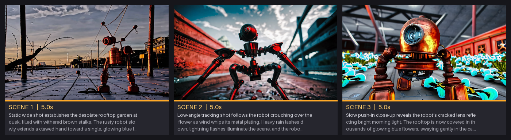

# 🎬 ComfyUI Auto Movie Director

**Type a movie idea. Get a finished short film — plot, scenes, camera work, sound, and a stitched MP4 — rendered locally with LTX 2.3.**

An LLM (via [Ollama](https://ollama.com)) acts as your screenwriter and director: it turns one prompt into a three-act film treatment with per-scene shot types, continuity, and sound design. Every scene renders as video **with audio**, and everything is automatically stitched into one high-quality MP4 — with a storyboard approval step in between, movie-studio style.



## How it works

```
your idea ──► 🎬 Movie Planner (Ollama LLM)          ──► plot + character sheet + N scene prompts
                    │                                        (three-act structure, shot grammar,
                    ▼                                         "Audio:" sound design per scene)
              🎬 Movie Renderer (LTX 2.3)
                    │
        mode 1) storyboard preview  ──► fast frame per scene + storyboard grid
        mode 2) full movie (img2vid) ──► each scene STARTS from its approved
                    │                    storyboard frame, upscaled + animated + audio
                    ▼
              scene_00.mp4 … scene_NN.mp4 ──► ffmpeg stitch ──► your_movie.mp4 🍿
```

1. **Write** — type your movie idea, pick the number of scenes and seconds per scene. Optional: type a prompt for any individual scene (empty boxes are written by the AI).
2. **Preview** — queue in `1) storyboard preview`: one fast frame per scene, laid out as a storyboard (saved to `output/auto_movie/`), plus the full script as text.
3. **Approve & render** — flip mode to `2) full movie (img2vid from storyboard)` and queue: every scene starts from the exact frame you approved (sharpened through the LTX spatial upscaler), gets motion and generated audio, and the final MP4 previews right on the node.
4. Don't want the storyboard step? `full movie (pure text2vid)` goes straight to render.

## Install

```bash
cd ComfyUI/custom_nodes
git clone https://github.com/AdamGman/ComfyUI-AutoMovieDirector
```

Then restart ComfyUI and open one of the workflows in `example_workflows/`.

### Requirements

| What | Why |
|---|---|
| [ComfyUI](https://github.com/comfyanonymous/ComfyUI) 0.27+ | node expansion API |
| [ComfyUI-LTXVideo](https://github.com/Lightricks/ComfyUI-LTXVideo) | LTX audio/video nodes |
| [ComfyUI-GGUF](https://github.com/city96/ComfyUI-GGUF) | only if you use GGUF-quantized LTX models |
| [Ollama](https://ollama.com) running locally | the screenwriter LLM |
| `imageio-ffmpeg` (pulled in by VideoHelperSuite, or `pip install imageio-ffmpeg`) | final stitching |

**LTX 2.3 models** (place in your usual model folders): the LTX 2.3 transformer (any variant — fp8, or GGUF + distilled LoRA), Gemma text encoder + LTX text projection, LTX video VAE + audio VAE, and the LTX spatial upscaler (recommended, used to sharpen storyboard frames before they guide the full render).

### The LLM — any Ollama model works

Set `ollama_model` on the Planner to **any** model name from the [Ollama library](https://ollama.com/library) — if it isn't installed yet, **it downloads automatically on first use**. Recommended: `qwen3.6:latest` (default) for the best scripts, `llama3.2:3b` if you want something small and fast. If Ollama isn't running at all, a built-in act-structure fallback still produces a working movie.

## The nodes

| Node | What it does |
|---|---|
| 🎬 **Movie Planner (Ollama)** | idea → plot, reusable character sheet, N scene prompts (shot type + camera + continuity + `Audio:` sound design each). Per-scene override boxes with storyboard thumbnails appear right on the node. |
| 🎬 **Movie Renderer (LTX scenes)** | expands at runtime into one LTX render chain per scene. Modes: storyboard preview / full movie from storyboard (img2vid) / pure text2vid. All quality settings: width, height, fps, steps, cfg, sampler, scheduler, seed, preview size, storyboard strength. |
| 🎬 **Movie Stitcher** | ffmpeg-concats all scenes into one MP4 (H.264 CRF 16 + AAC), previews it on the node, optional extra `output_dir`. |
| 🎬 Storyboard / Scene Writer / Load Frame / Path Join | internals used by the renderer's expansion. |

## Outputs

```
output/
├── your_movie_20260706_193834.mp4      ← the finished film (video + audio)
└── auto_movie/
    ├── storyboard_<id>/                ← storyboard.png, scene_XX.png, scenes.txt
    └── <run_id>/                       ← per-scene MP4s + plot.txt
```

## Tips

- **Keep seed + prompts unchanged** between storyboard and full render — that's how the frames are matched.
- `storyboard_strength` (default 0.8): higher = the scene sticks harder to the approved frame; lower = more natural motion and texture.
- 1536×864 @ 24 fps is the sweet spot on a 24 GB GPU; a 5-second scene renders in ~2 minutes on an RTX 4090.
- Big scene counts: RAM is the limit (decoded frames are cached during the run) — 12 scenes at 1536×864 wants ~32 GB+ free RAM.

## License

MIT
